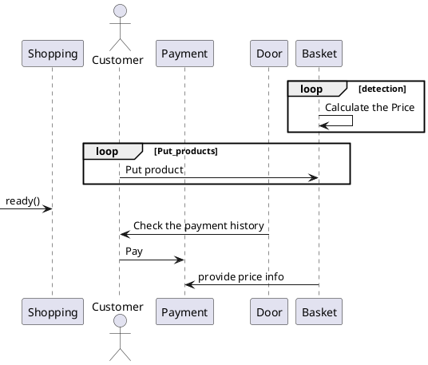

# kcci_intel_AI_project

## 1.문제점 정의
```
지금 시행되고 있는 셀프 계산대는 장바구니에 물품을 넣은 뒤에
계산하는 곳에서 물품 하나하나 바코드를 찍어 계산해야 한다
장바구니에 카메라를 이용해 장바구니 안에서 자동으로 가격이 합산된다면
따로 바코드를 찍어야 하는 번거로움이 사라질 것이라고 생각한다.
또한 고령층이 셀프 계산대를 이용하기 어려운데 제안하는 방식을 이용한다면
그 어려움이 다소 해결될 것이라고 생각한다.
```
## 2.유즈케이스 시나리오
```
1. 사용자가 무인점포에 도착하고 장바구니 수령.
2. 사용자는 장바구니에 상품을 넣습니다.
3. 상품이 장바구니에 추가되면, 해당삼품의 가격을 자동으로 인식하고 더해줍니다.
4. 사용자가 추가 상품을 선택하고 위 단계를 반복.
5. 결제 여부에 따라서 출구가 개방된다. (출구와 입구를 따로 설정한다)
```

## 3. High level design


