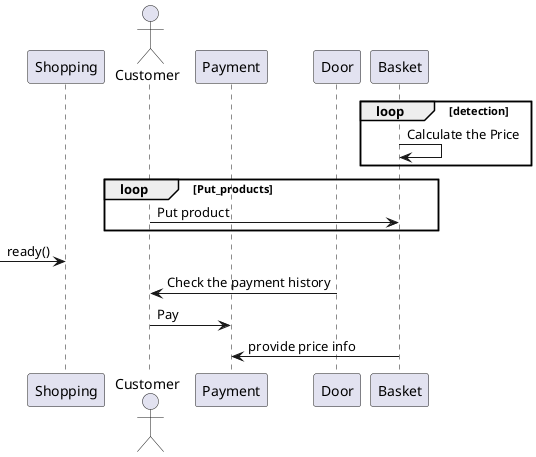

# kcci_intel_AI_project

## 1. 문제점 정의
```
지금 시행되고 있는 셀프 계산대는 장바구니에 물품을 넣은 뒤에
계산하는 곳에서 물품 하나하나 바코드를 찍어 계산해야 한다
장바구니에 카메라를 이용해 장바구니 안에서 자동으로 가격이 합산된다면
따로 바코드를 찍어야 하는 번거로움이 사라질 것이라고 생각한다.
또한 고령층이 셀프 계산대를 이용하기 어려운데 제안하는 방식을 이용한다면
그 어려움이 다소 해결될 것이라고 생각한다.
```
## 2. 유즈케이스 시나리오

- **목표 : 사용자는 스마트 장바구니를 사용해서 물품을 계산한다.**
    - 성공 시나리오
        1. 사용자는 스마트 장바구니에 물품을 넣는다.
        2. 시스템은 카메라를 통해 물품 정보를 읽어, 사용가능한 메뉴를 화면에 표시한다.
        3. 사용자는 화면에서 물품 담기, 물품 빼기를 선택한다.
        4. 시스템은 자동으로 물품을 합산한다.
        5. 시스템은 장바구니 담겨있는 물품목록을 화면에 표시한다.  
        6. 계산대에서 최종 계산한다.
    - 확장 시나리오
        - 사용자가 물품 인식을 못하는 경우
            - 시스템은 사용자에게 메시지를 띄운다.
        - 사용자가 물품 정보를 제대로 읽지 않고 물품을 넣을 시
            - 시스템은 사용자에게 경고메시지를 띄운다.
            - 시스템은 해당 상황을 기록해서 메인 시스템으로 정보를 전송한다.

## 3. High level design


<details>
<summary>uml</summary>
<div markdown="1">


</div>
</details>

